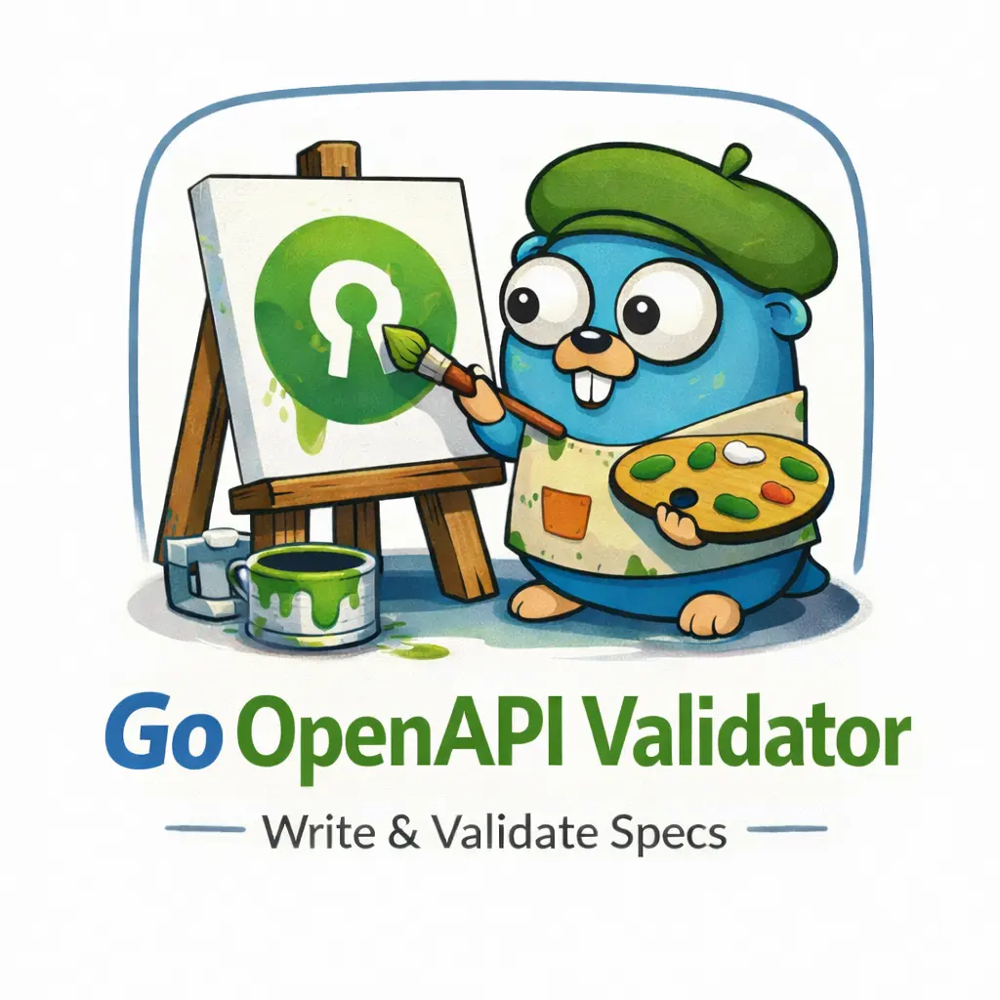

<div align="center">
  
  <h1>Go OpenAPI Validator</h1>
  <p>
    <b>A framework-agnostic OpenAPI v3 validator for Go, designed for performance and reliability.</b>
  </p>
  <p>
    
    
    
    <br/>
    
    
    <br/>
    
    
    
  </p>
</div>

---

## 📖 Overview

**Go OpenAPI Validator** is a high-performance, framework-agnostic library for validating HTTP requests and responses against **OpenAPI v3** specifications. Inspired by [express-openapi-validator](https://github.com/cdimascio/express-openapi-validator), it provides a robust middleware layer that ensures your API remains consistent with its documentation.

We focus on minimalism and reliability, with **zero external testing dependencies** and a lean footprint.

## ✨ Key Features

- **🚀 Framework Agnostic**: Native support for `net/http`, [Gorilla Mux](https://github.com/gorilla/mux), and [Gin](https://github.com/gin-gonic/gin).
- **🛡️ Request Validation**: Automatic validation of request bodies, query parameters, and headers.
- **✅ Response Validation**: Optional outgoing response validation to catch implementation errors.
- **📄 Swagger UI**: Built-in, zero-config Swagger UI integration served at `/docs`.
- **🧪 Professional Grade**: Comprehensive test suite using only the Go standard library.
- **⚙️ Highly Configurable**: Custom error encoders, router selection, and more.

## 🛠️ System Requirements

Before you begin, ensure you have the following installed:

- **Go**: v1.21.x or higher (Tested with v1.23+)
- **Git**: For version control

## 🚀 Getting Started

### 1. Installation

```bash
go get github.com/vihuvac/go-openapi-validator
```

### 2. Usage Examples

#### Standard Library (`net/http`)

```go
package main

import (
	"log"
	"net/http"
	"github.com/getkin/kin-openapi/routers/legacy"
	validator "github.com/vihuvac/go-openapi-validator"
)

func main() {
	v, err := validator.New("openapi.yaml")
	if err != nil {
		log.Fatal(err)
	}

	// For net/http, use the legacy router
	r, _ := legacy.NewRouter(v.Swagger)
	validator.WithRouter(r)(v.Options)

	mux := http.NewServeMux()
	v.HandleSwaggerUI(mux)

	mux.HandleFunc("/hello", func(w http.ResponseWriter, r *http.Request) {
		w.Header().Set("Content-Type", "application/json")
		w.Write([]byte(`{"message": "Hello World"}`))
	})

	log.Fatal(http.ListenAndServe(":8080", v.Middleware(mux)))
}
```

## 📂 Project Structure

```text
.
├── docs/             # Documentation and assets
├── examples/         # Router-specific implementation examples
│   ├── gin/          # Gin-gonic integration
│   ├── gorilla/      # Gorilla Mux integration
│   └── standard/     # Standard net/http integration
├── swagger-ui/       # Embedded Swagger UI assets
├── errors.go         # Custom error handling and encoders
├── options.go        # Configuration options (Functional options pattern)
├── swagger.go        # Swagger UI serving logic
└── validator.go      # Core validation middleware
```

## ⚙️ Configuration

| Option | Description | Default |
| --- | --- | --- |
| `WithValidateRequests(bool)` | Enable/Disable request validation | `true` |
| `WithValidateResponses(bool)` | Enable/Disable response validation | `false` |
| `WithSwaggerUIPath(string)` | Change Swagger UI base path | `/docs` |
| `WithErrorEncoder(ErrorEncoder)` | Custom error response format | `DefaultErrorEncoder` |
| `WithRouter(routers.Router)` | Set a custom OpenAPI router | `gorillamux.NewRouter` |

## 🧪 Running Tests

Maintain code quality by running the comprehensive test suite:

```bash
# Run all unit tests
go test ./...

# Run tests with coverage
go test -coverprofile=coverage.out ./...
go tool cover -html=coverage.out
```

## 🤝 Contributing

Contributions are welcome! Check out the [Contribution Guide](./CONTRIBUTING.md) to get started.

## 📄 License

This project is licensed under the **MIT License**. See the [LICENSE](./LICENSE) file for more details.

## Additional Resources

### Project
- [Changelog](./CHANGELOG.md)
- [Security Policy](./SECURITY.md)
- [Code of Conduct](./CODE_OF_CONDUCT.md)

### Tools
- [Swagger UI](https://swagger.io/tools/swagger-ui/)
- [OpenAPI Specification v3](https://swagger.io/specification/v3/)
- [Kin OpenAPI](https://github.com/getkin/kin-openapi)
